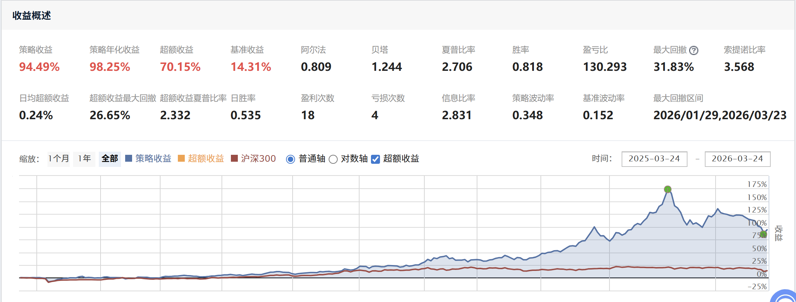
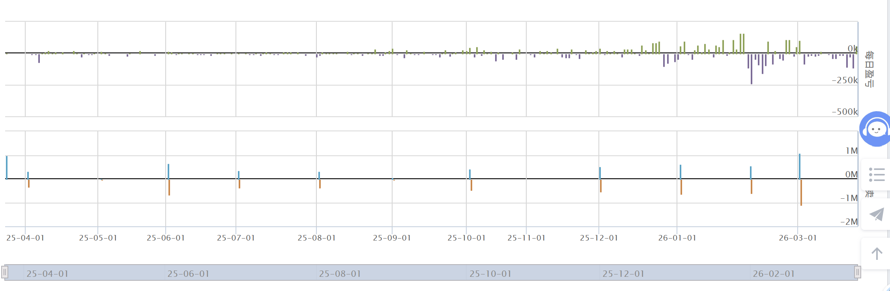

# Quant Strategy

## Strategy

This is a simple momentum strategy.
It buys assets with good recent performance and rebalances regularly.

---

## Result

### Equity Curve

### Performance

---

## Summary

* Annual Return: 98.25%
* Sharpe Ratio: 2.70
* Max Drawdown: 31.83%

---

## Files

* strategy.py
* result1.png
* result2.png
